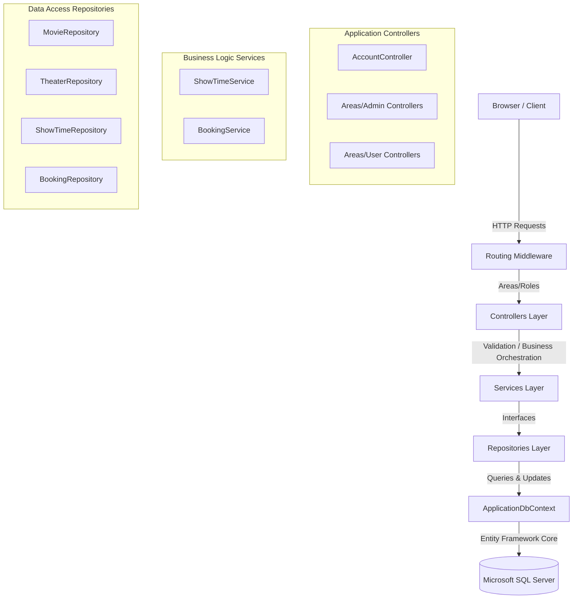
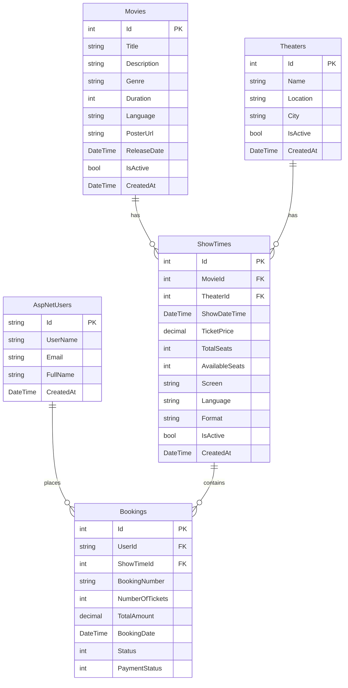

# Movie Booking Application — Architecture & Technical Documentation

This document describes the design, architecture, database schema, and implementation details of the refactored **Movie Booking Application**. The application was migrated from ASP.NET Core Razor Pages to **ASP.NET Core MVC** (.NET 9) using **Entity Framework Core** and **ASP.NET Core Identity**.

---

## 1. Architectural Overview

The application follows the **Separation of Concerns (SoC)** principle, structured into logical layers to support maintainability, testability, and scalability.



### Layer Breakdown
1. **Presentation Layer (Controllers & Views)**: Handles HTTP requests, performs input validation via model state checks, and renders HTML views using strongly-typed ViewModels.
2. **Business Services Layer**: Encapsulates core business rules (e.g., date checks, theater scheduling overlap checks, and atomic seat reservation logic).
3. **Data Access Layer (Repositories)**: Implements the Repository Pattern, isolating raw Entity Framework Core queries and entity tracking states away from application layers.
4. **Database Context (`ApplicationDbContext`)**: Coordinates EF Core entities with SQL Server tables, configuration mappings, decimal precisions, and indexes.

---

## 2. Database Schema & Models

The database contains 5 core tables governed by **ASP.NET Core Identity** and application entities.



### Table Schema Configurations
* **Booking Precision**: `TotalAmount` mapped with decimal precision `(18, 2)`.
* **ShowTime Precision**: `TicketPrice` mapped with decimal precision `(18, 2)`.
* **Booking Constraints**: An index is placed on `BookingNumber` marked as `IsUnique`.
* **Foreign Key Cascade Controls**: Delete behaviours on `ShowTime -> Movie` and `ShowTime -> Theater` relations are set to `DeleteBehavior.Restrict` to prevent cascade deletions of parent data.

---

## 3. Security & Authentication

The application uses **ASP.NET Core Identity** cookie-based authentication with role-based routing.

### Seeding Roles & Admin User
Upon application startup, the database is checked and seeded with two roles and a default admin user:
* **Roles**: `Admin` and `User`
* **Default Admin Credentials**:
  * **Email**: `admin@moviebook.com`
  * **Password**: `Admin123`

### Security Filters
* **Admin Controllers** are decorated with `[Area("Admin")]` and `[Authorize(Roles = "Admin")]`.
* **User Controllers** are decorated with `[Area("User")]` and `[Authorize]`.
* **Cross-Site Request Forgery (CSRF)** protection is enabled on all POST actions using `[ValidateAntiForgeryToken]` and tag helpers.

---

## 4. Key Business Logic Implementations

### A. Atomic Seat Reservations (`BookingService.cs`)
When a user books tickets, the transaction is processed sequentially:
1. Verify if `ShowTime` exists.
2. Check if the showtime has enough available seats:
   ```csharp
   AvailableSeats >= requestedSeats && IsActive
   ```
3. Decrement seats and save changes:
   ```csharp
   showTime.AvailableSeats -= numberOfTickets;
   await _showTimeRepository.UpdateAsync(showTime);
   ```

### B. Showtime Schedule Overlap Checks (`ShowTimeService.cs`)
During showtime creation, the application prevents double-booking a screen/theater:
1. Check that the date/time is at least **1 hour from now** and no more than **1 year in the future**.
2. Check for overlapping showtimes at the selected theater within a **3-hour window** (before or after the proposed start time):
   ```csharp
   st.ShowDateTime >= proposedDateTime.AddHours(-3) && st.ShowDateTime <= proposedDateTime.AddHours(3)
   ```

### C. Booking Cancellation Rules
1. Restore seats to the showtime up to the theater's maximum limit:
   ```csharp
   showTime.AvailableSeats += booking.NumberOfTickets;
   if (showTime.AvailableSeats > showTime.TotalSeats)
       showTime.AvailableSeats = showTime.TotalSeats;
   ```
2. Update the booking status flags to `Cancelled` and the payment status flags to `Refunded`.
